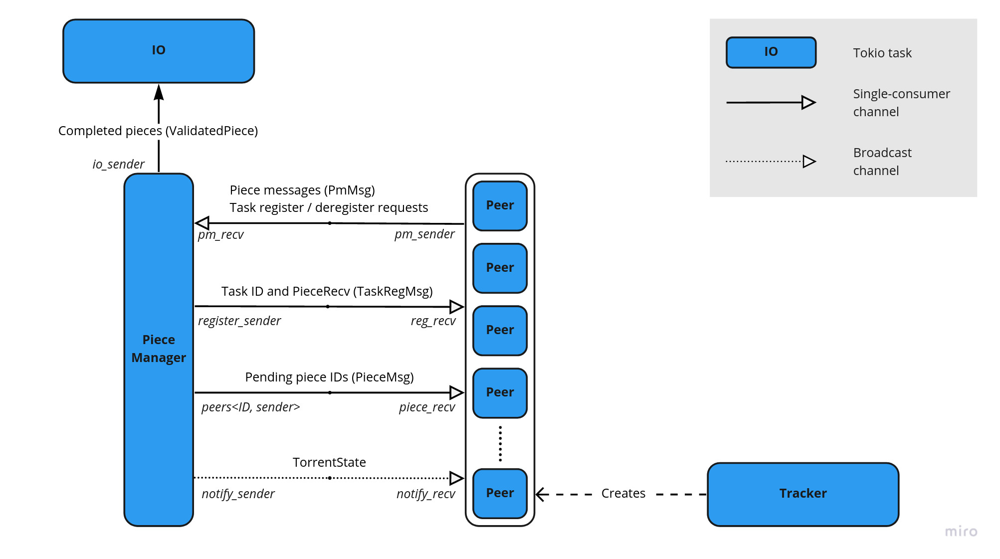

This program implements a simple BitTorrent client using Tokio. The client communicates with other clients
using TCP. Currently only leeching is implemented. The pieces are picked sequentially and an [endgame](https://wiki.theory.org/BitTorrentSpecification#End_Game) mode is implemented.

# Architecture

# TODO
- [ ] (dev) error handling
- [ ] Periodically contacting the tracker and maintaining a good amount of connections
- [ ] Rarest-first piece picking algorithm
- [ ] [FastPeers](https://wiki.theory.org/BitTorrentSpecification#Fast_Peers_Extensions) extension
- [ ] [DHT](https://wiki.theory.org/BitTorrentSpecification#Distributed_Hash_Table)

# Sources
- Unofficial specification: https://wiki.theory.org/BitTorrentSpecification  
- Guide - https://www.seanjoflynn.com/research/bittorrent.html  
- Guide: https://blog.jse.li/posts/torrent/  