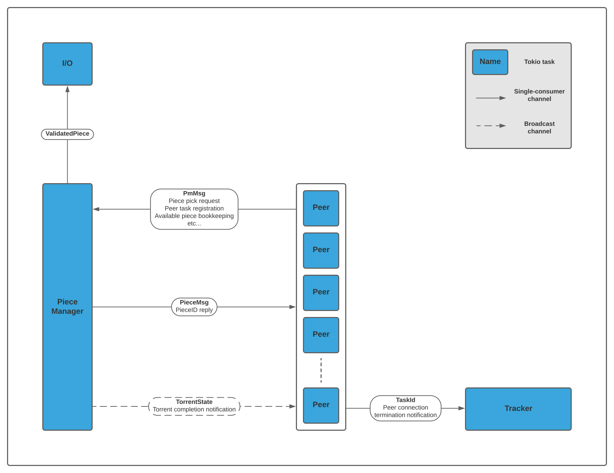

This is a simple BitTorrent client using Tokio. The client communicates with other clients
using TCP. Currently only leeching is implemented. Piece picking is (mostly) sequential and an [endgame](https://wiki.theory.org/BitTorrentSpecification#End_Game) mode is implemented.

# Architecture

# TODO
- [x] Endgame mode
- [x] UDP trackers
- [x] Multi-file torrents
- [ ] Seeding
- [ ] Periodically contacting the trackers
- [ ] Rarest-first piece picking algorithm
- [ ] [FastPeers](https://wiki.theory.org/BitTorrentSpecification#Fast_Peers_Extensions) extension
- [ ] [DHT](https://wiki.theory.org/BitTorrentSpecification#Distributed_Hash_Table) (pipe dream)

# Sources
- Unofficial specification: https://wiki.theory.org/BitTorrentSpecification  
- UDP tracker protocol specs: https://github.com/steeve/libtorrent/blob/master/docs/udp_tracker_protocol.rst#request-string  
- Guide - https://www.seanjoflynn.com/research/bittorrent.html  
- Guide: https://blog.jse.li/posts/torrent/  